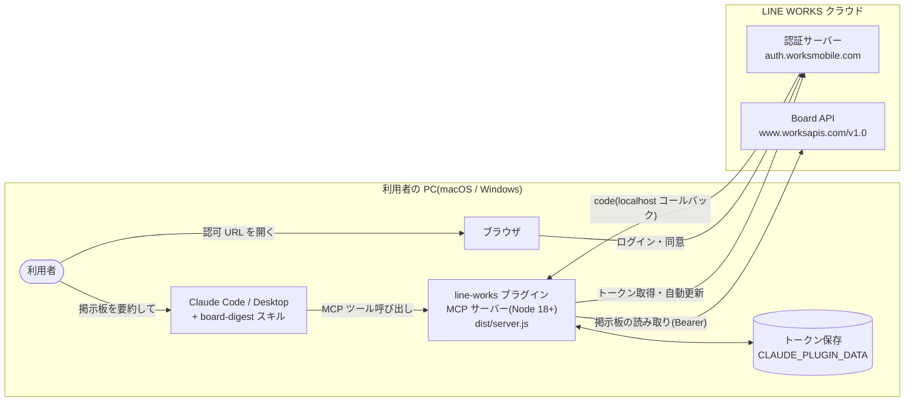
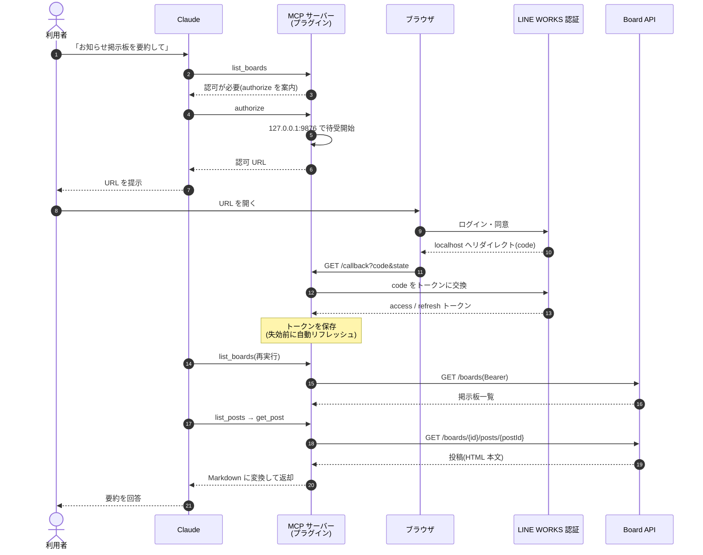

# LINE WORKS 掲示板プラグイン for Claude

LINE WORKS の掲示板(Board)を Claude(Code / Desktop)から読み取り、要約・検索・活用できるようにする**読み取り専用**プラグインです。

> 「総務の掲示板の今週の投稿を要約して」「経費精算のお知らせを探して」— そんな依頼が Claude にそのまま通ります。

## 特長

- **読み取り専用** — 投稿・編集・削除は一切できないため、誤操作の心配がありません
- **本人の権限どおり** — 各利用者が自分の LINE WORKS アカウントでログインし、本人が閲覧できる掲示板だけが見えます(ユーザー OAuth)
- **非エンジニアでも導入可能** — ビルド不要。インストールして ID を貼り付け、ブラウザでログインするだけ
- **macOS / Windows 対応** — Node.js 18 以降のみが前提です

## システム構成

### アーキテクチャ

プラグインはすべて利用者の PC 内で動きます(中間サーバーなし)。認証情報とトークンが第三者のサーバーを経由することはありません。



### シーケンス(初回の認可〜掲示板の要約)



ローカルコールバックが成立しない環境では、リダイレクト先 URL を利用者がコピーして Claude に貼り付けるフォールバック(`authorize` の `code_or_url`)で同じ処理が行われます。

### 対応環境と配布形式

| 環境 | 対応 | 配布形式 | 備考 |
|---|---|---|---|
| Claude Desktop | ✅ | `.mcpb`(Anthropic 公式の Desktop 拡張機能) | Releases ページから `.mcpb` をダウンロード → 設定 → 拡張機能から追加。Node.js のインストール不要(Desktop がランタイム提供)。**Free プランでも利用可能** |
| Claude Code(CLI / IDE) | ✅ | プラグイン(このリポジトリのマーケットプレイス経由) | `/plugin marketplace add aalto-consulting-inc/claude-line-works` → `/plugin install line-works@aalto-plugins`。Claude Code は Pro / Max / Team / Enterprise プラン向け |
| claude.ai(ブラウザ版チャット) | ❌ | — | ローカル MCP サーバーを実行できないため。対応にはリモート MCP のホスティングが必要(将来検討) |

※ 実機検証は macOS(Claude Code CLI + Claude Desktop)で実施。Windows も Node 18+ 環境で動作する想定だが、公開前の実機検証は行わないため公開後にフィードバックがあれば個別対応します。

## インストール

- **管理者の方**(最初の一度だけ必要な設定): [docs/setup-admin.md](docs/setup-admin.md)
- **利用者の方**(Claude Desktop / Claude Code CLI 両対応の手順): [docs/setup-user.md](docs/setup-user.md)

## 提供ツール

| ツール | 説明 |
|---|---|
| `authorize` | LINE WORKS へのログイン認可 |
| `list_boards` | 掲示板の一覧 |
| `list_recent_posts` | 全掲示板を横断した最新投稿一覧 |
| `list_posts` | 掲示板の投稿一覧 |
| `get_post` | 投稿本文(Markdown 変換) |

※ 読み取り対象は投稿本文まで(コメントは対象外)。

`board-digest` スキルが同梱されており、掲示板の要約・情報探索の依頼を適切なツール呼び出しに展開します。

## 開発

```sh
cd server
npm ci
npm run typecheck   # 型チェック
npm test            # ユニットテスト
npm run build       # ../dist/server.js にバンドル(コミット対象)
node ../scripts/smoke.mjs   # バンドルのスモークテスト
```

- 実 API の検証記録: [docs/api-notes.md](docs/api-notes.md)
- 手動 E2E 検証チェックリスト: [docs/verification.md](docs/verification.md)
- ローカルでプラグインとして試す: `claude --plugin-dir .`
- Claude Desktop 用 MCPB(`.mcpb`)をビルド: `cd server && npm run build:mcpb`(`build/line-works-board.mcpb` が出力される)

## TODO(公開後)

- [ ] **パイロット導入** — クライアント 1 社で運用開始 → フィードバック反映 → `v1.0.0`
- [ ] **Windows 実機検証**(任意・フィードバック起点で対応)
- [ ] **CI 整備**(オプショナル)— ubuntu / macos / windows-latest の 3 OS マトリクスで vitest ユニット + サーバー起動スモーク(`node dist/server.js` がツール一覧を返す)+ `claude plugin validate --strict` + secret scan を毎 PR 実行

## 参考リンク

- [LINE WORKS Developers ドキュメント](https://developers.worksmobile.com/jp/docs)
- [Board(掲示板)API](https://developers.worksmobile.com/jp/docs/board)
- [ユーザーアカウント認証(OAuth 2.0)](https://developers.worksmobile.com/jp/docs/auth-oauth)
- [Claude Code プラグインドキュメント](https://code.claude.com/docs/en/plugins)

## ライセンス

MIT
