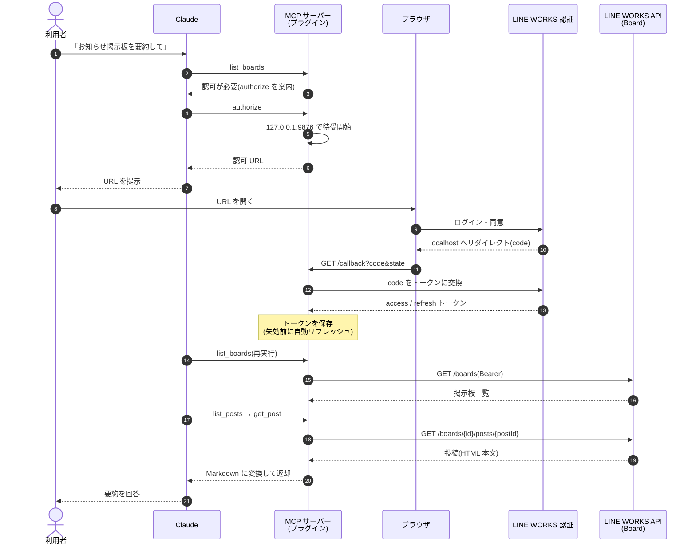

# LINE WORKS MCP プラグイン for Claude

LINE WORKS を Claude(Code / Desktop)から利用するための MCP プラグインです。

> [!TIP]
> 「総務の掲示板の今週の投稿を要約して」「経費精算のお知らせを探して」— そんな依頼が Claude でできます。

## 対応機能

| LINE WORKS の機能 | 対応状況 | 備考 |
|---|---|---|
| 掲示板(Board) | ✅ 読み取りのみ | 掲示板一覧・投稿一覧・投稿本文の読み取りに対応。投稿のコメントの読み取りは未対応 |
| トーク / Bot | ❌ 未対応 | 将来検討 |
| カレンダー | ❌ 未対応 | 将来検討 |
| 組織・メンバー情報 | ❌ 未対応 | 将来検討 |

要求する OAuth スコープも現在は掲示板の読み取り(`board.read`)のみです。機能追加時はスコープの追加が必要になります。

## 特長

- **読み取り専用** — 現時点のツールはすべて読み取りのみ。投稿・編集・削除は一切できないため、誤操作の心配がありません
- **本人の権限どおり** — 各利用者が自分の LINE WORKS アカウントでログインし、本人がアクセスできる範囲だけが見えます(ユーザー OAuth)
- **非エンジニアでも導入可能** — ビルド不要。インストールして ID を貼り付け、ブラウザでログインするだけ
- **macOS / Windows 対応**

## 対応環境と配布形式

| 環境 | 対応 | 配布形式 | 備考 |
|---|---|---|---|
| Claude Desktop | ✅ | `.mcpb`(Anthropic 公式の Desktop 拡張機能) | **Free プランでも利用可能**。Node.js のインストール不要(Desktop がランタイム提供) |
| Claude Code(CLI / IDE) | ✅ | プラグイン(このリポジトリのマーケットプレイス経由) | Claude Code は Pro / Max / Team / Enterprise プラン向け(Node.js 18 以降を含む) |
| claude.ai(ブラウザ版チャット) | ❌ | — | ローカル MCP サーバーを実行できないため。対応にはリモート MCP のホスティングが必要(将来検討) |

※ 実機検証は macOS(Claude Code CLI + Claude Desktop)で実施。Windows も Node 18+ 環境で動作する想定だが、公開前の実機検証は行わないため公開後にフィードバックがあれば個別対応します。

## インストール

- **管理者向け**: [docs/setup-admin.md](docs/setup-admin.md) : 最初に設定が必要
- **利用者向け**: [docs/setup-user.md](docs/setup-user.md) : Claude Desktop / Claude Code CLI 両対応の手順

## 提供ツール

### 共通

| ツール | 説明 |
|---|---|
| `authorize` | LINE WORKS へのログイン認可 |

### 掲示板(Board)

| ツール | 説明 |
|---|---|
| `list_boards` | 掲示板の一覧 |
| `list_recent_posts` | 全掲示板を横断した最新投稿一覧 |
| `list_posts` | 掲示板の投稿一覧 |
| `get_post` | 投稿本文(Markdown 変換) |

掲示板向けの `board-digest` スキルが同梱されており、掲示板の要約・情報探索の依頼を適切なツール呼び出しに展開します。

## システム構成

### アーキテクチャ

プラグインはすべて利用者の PC 内で動きます(中間サーバーなし)。認証情報とトークンが第三者のサーバーを経由することはありません。


### シーケンス(初回の認可〜掲示板の要約)



ローカルコールバックが成立しない環境では、リダイレクト先 URL を利用者がコピーして Claude に貼り付けるフォールバック(`authorize` の `code_or_url`)で同じ処理が行われます。

## 開発

```sh
cd server
npm ci
npm run typecheck   # 型チェック
npm test            # ユニットテスト
npm run build       # ../dist/server.js にバンドル(コミット対象)
node ../scripts/smoke.mjs   # バンドルのスモークテスト
```

- 実 API の検証記録: [docs/api-notes.md](docs/api-notes.md)
- 手動 E2E 検証チェックリスト: [docs/verification.md](docs/verification.md)
- ローカルでプラグインとして試す: `claude --plugin-dir .`
- Claude Desktop 用 MCPB(`.mcpb`)をビルド: `cd server && npm run build:mcpb`(`build/line-works.mcpb` が出力される)

### リリース

1. **バージョンを上げる** — `.claude-plugin/plugin.json` / `mcpb/manifest.json` / `server/package.json` の `version` を揃える(`cd server && npm version <x.y.z> --no-git-tag-version` + 残り 2 ファイルを手で更新)
2. **バンドルを更新してコミット** — `cd server && npm run build`(`dist/server.js` はコミット対象。未更新だと CI が落ちる)
3. **main にマージ** — この時点で Claude Code(マーケットプレイス経由)の利用者に反映される
4. **タグを push** — `git tag v<x.y.z> && git push origin v<x.y.z>`

タグ push で [`.github/workflows/release.yml`](.github/workflows/release.yml) が動き、バージョンとタグの一致確認 → テスト → `.mcpb` ビルド → **下書きの** GitHub Release を作成し `line-works.mcpb` を添付する。内容を確認して手動で publish すると、Claude Desktop の利用者向けリンク(`releases/latest/download/line-works.mcpb`)が新版を指す。

## TODO(公開後)

- [ ] **パイロット導入** — 試験運用開始 → フィードバック反映 → `v1.0.0`
- [ ] **Windows 実機検証**(任意・フィードバック起点で対応)
- [ ] **Dependabot のバージョン更新を有効化** — 現在は脆弱性起点のセキュリティ更新のみ。定期更新を再開する場合は [`.github/dependabot.yml`](.github/dependabot.yml) の `open-pull-requests-limit` を `0` から戻す。依存更新は `dist/server.js` のバンドル内容を変えるため、PR ごとに `cd server && npm run build` して `dist/` をコミットする運用が前提

## 参考リンク

- [LINE WORKS Developers ドキュメント](https://developers.worksmobile.com/jp/docs)
- [Board(掲示板)API](https://developers.worksmobile.com/jp/docs/board)
- [ユーザーアカウント認証(OAuth 2.0)](https://developers.worksmobile.com/jp/docs/auth-oauth)
- [Claude Code プラグインドキュメント](https://code.claude.com/docs/en/plugins)

## ライセンス

MIT
